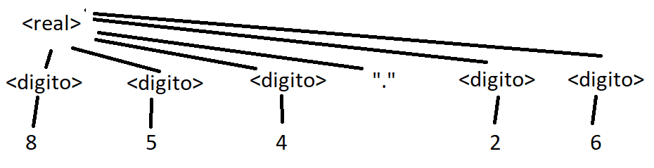

# Práctica 2

Course: https://www.notion.so/Conceptos-y-Paradigmas-de-Lenguajes-de-Programaci-n-c3f3222b810045b9b4e8dfe48638f38a
Due date: March 31, 2023
Status: Done

# Sintaxis

1. a
   

2. La sintaxis es el conjunto de reglas que definen cómo componer letras, dígitos y otros caracteres que permiten formar los programas y que la comunicación entre el programador y la computadora sea clara. Permite escribir programas válidos y coherentes, correctos sintácticamente.

   Sus elementos son:

   - **Alfabeto o conjunto de caracteres**: Importante: Tener en cuenta con qué conjunto de caracteres se trabaja sobre todo por el orden a la hora de comparaciones. La secuencia de bits que compone cada carácter la
     determina la implementación. Por lo general los lenguajes trabajan con código ASCII con algún tipo de codificación.
   - **Identificaciones**: Es una cadena de caracteres o dígitos que se utiliza para nombrar algo en particular. Si se restringe la longitud para declarar identificadores se pierde legibilidad. Nombres de variables, funciones, y cualquier entidad de un programa.
   - **Operadores**: Operadores de suma, resta, etc. La mayoría utilizan +, -. En los otros operadores quizás no hay tanta uniformidad (\*\* vs. ^).
   - **Palabras claves y reservadas**: Las palabras **clave** son aquellas que tienen significado dentro de un contexto en un momento determinado. Las palabras **reservadas** son palabras claves que no pueden ser utilizadas por el programador como identificador de otra entidad. Utilizarlas permiten al compilador y al programador expresarse claramente, además, hacen programas más legibles y permiten una rápida traducción. Estas palabras sirven para evitar confusión entre palabras claves e identificadores. Todas las palabras reservadas son claves pero no viceversa.
   - **Comentarios y uso de blancos**:

3. Las reglas léxicas y sintácticas le dan la apariencia externa al lenguaje, establecen reglas para la estructura de la sintaxis. La estructura de la sintaxis se compone de:

   - **`Words`**: Vocabulario o words es el conjunto de palabras y caracteres necesarios para construir expresiones, sentencias y programas. Por ejemplo: identificadores, operadores, palabras clave, etc. Las words no son elementales, se construyen a partir del alfabeto.
   - **`Expresiones`**: No son más que funciones a partir de un conjunto de datos que devuelven un valor, son bloques sintácticos.
   - **`Sentencias`**: Es el componente más importante. Tiene un fuerte impacto en la escritura y legibilidad. Hay sentencias simples, estructuradas y anidadas.

   Las reglas de la estructura son:

   - **Reglas léxicas**: Conjunto de reglas para formar las _word_, a partir de caracteres del alfabeto. Por ejemplo: diferencias entre mayúsculas y minúsculas, símbolos distintos, etc.
   - **Reglas sintácticas**: Conjunto de reglas que definen cómo formar las expresiones y sentencias. Por ejemplo: cuando se escriba la sentencia if se debe escribir la palabra if, luego la condición, luego el then, el begin, la sentencia, etc.

4. Las palabras **_reservadas_** son palabras claves que no pueden ser utilizadas por el programador para identificar otra entidad, es decir, son palabras con un significado especial dentro del lenguaje y que no pueden ser utilizadas para nombrar variables o funciones.

   En la definición de una gramática, las palabras reservadas se conocen como símbolos no terminales y se utilizan para definir las reglas de producción que generan las estructuras sintácticas del lenguaje.

   Un ejemplo de palabra reservada en JavaScript es **`var`**. Esta palabra se utiliza para declarar una variable en JavaScript, por lo que no puede ser utilizada como nombre de variable. Otros ejemplos de palabras reservadas en JavaScript incluyen **`if`**, **`else`**, **`while`**, **`for`**, **`function`**, **`return`**, **`true`**, **`false`**, **`null`**, **`undefined`**, **`try`**, **`catch`**, **`throw`**, **`typeof`**, entre otras.

5. ```bnf
                  G= ( N, T, S, P)
                  N = {<numero_entero>, <digito> }
                  T = {0, 1, 2, 3, 4, 5, 6, 7, 8, 9}
                  S = <numero_entero>
                  P = {
                  <numero_entero>::=<digito><numero_entero> | <numero_entero><digito> | <digito>
                  <digito> ::= 0 | 1 | 2 | 3 | 4 | 5 | 6 | 7 | 8 | 9
                  }
   ```

   a. Los componentes de la misma son:

   - G: Gramática, son reglas finitas que definen un conjunto infinito de posibles sentencias válidas en el lenguaje. Está formada por una 4-tupla.
   - N: Es el conjunto de símbolos no terminales, en este caso los no terminales serían `<numero_entero>` y `<digito>`.
   - T: Es el conjunto de símbolos terminales. En este caso es el conjunto: `{0, 1, 2, 3, 4, 5, 6, 7, 8, 9}`
   - S: Es el símbolo distinguido de la gramática. En este ejemplo es: `<numero_entero>`.
   - P: Es el conjunto de producciones de la gramática. En este ejemplo tenemos dos producciones:
     `c
<numero_entero>::=<digito><numero_entero> | <numero_entero><digito> | <digito>
<digito> ::= 0 | 1 | 2 | 3 | 4 | 5 | 6 | 7 | 8 | 9
`
     b. Esta solución es ambigua debido a que una sentencia puede derivarse de más de una forma, en este caso está utilizando recursión por derecha y por izquierda al mismo tiempo, lo que podría generar problemas en el árbol de sintaxis.

   La solución correcta es:

   ```ebnf
   G= ( N, T, S, P)
   N = {<numero_entero>, <digito> }
   T = {0, 1, 2, 3, 4, 5, 6, 7, 8, 9}
   S = <numero_entero>
   P = {
   <numero_entero>::= <digito> | <digito><numero_entero>
   <digito> ::= 0 | 1 | 2 | 3 | 4 | 5 | 6 | 7 | 8 | 9
   }
   ```

6.

```bnf
G = (N, T, S, P)
N = {<letra>, <palabra>}
T = {a-z, A-Z, " "}
S = <palabra>
P = {
	<palabra> ::= <letra> | <letra><palabra>
	<letra> ::= a | ... | z | " "
}
```

7.

```bnf
G = (N, T, S, P)
N = {<real>, <integer>, <digito>}
T = {0, 1, 2, 3, 4, 5, 6, 7, 8, 9, ".", "+", "-"}
S = <real>
P = {
	<real> ::= + <integer> "." <integer> | - <integer> "." <integer>
	<integer> ::=  <digito> | <digito><integer>
	<digito> ::= 0 | ... | 9
}
```

```ebnf
G = (N, T, S, P)
N = {<real>, <digito>}
T = {0, 1, 2, 3, 4, 5, 6, 7, 8, 9, ".", "-"}
S = <real>
P = {
	<real> ::= ["-"] {<digito>}+ ["." {<digito>}+]
	<digito> ::= 0 | ... | 9
}
```

8.  1. Conceptos

       

    2. Programación

       

    3. 1255869

       

    4. 854,26 //**CONSULTAR**

       

    5. Conceptos de lenguajes

       lo mismo q los otros zzz

9.  ```ebnf
    G = (N, T, S, P)
    N = {<id>, <caracter>, <letra>, <dig>}
    T = {a-z, A-Z, 0-9}
    S = <id>
    P = {
    	<id> ::= <letra>{<caracter>}*
    	<caracter> ::= (<letra> | <dig>)
    	<letra> ::= (a | ... | z | A | ... | Z)
    	<dig> ::= (0 | ... | 9)
    }
    ```

    

10. 1.  ```ebnf
        G = (N, T, S, P)
        N = {<expr>, <numero>, <digito>, <variable>, <op>, <operador>, <letras>}
        T = {0-9, +, -, /, *, a-z, A-Z}
        S = <expr>
        P = {
        	<digito> ::= (0 | ... | 9)
        	<letras> ::= (a | ... | z | A | ... | Z)
        	<numero> ::= <digito>{<digito>}*
        	<variable> ::= <letras> {<letras>}*
        	<operador> ::= (<numero> | <variable>)
        	<op> ::= (+ | - | / | *) <operador>
        	<expr> ::=  <operador>{<operación>}+
        }
        ```

    2.  ```ebnf
        G = (N, T, S, P)
        N = {<expr>, <numero>, <digito>, <variable>, <op>, <operador>, <letras>}
        T = {0-9, +, -, /, *, a-z, A-Z}
        S = <expr>
        P = {
        	<digito> ::= (0 | ... | 9)
        	<letras> ::= (a | ... | z | A | ... | Z)
        	<numero> ::= <digito>{<digito>}*
        	<variable> ::= <letras> {<letras>}*
        	<operador> ::= (<numero> | <variable>)
        	<mul_div> ::= (/ | *) <operador>
        	<op> ::= (<operador><mul_div> | <operador>)
        	<sum_res> ::= (- | +) <op>
        	<expr> ::=  <op>{<sum_res>}*
        }
        ```

    3.  Para agregarle prioridad a las expresiones fue importante tener en cuenta la prioridad de los operadores, a partir de esto sabemos que los de mayor prioridad serán las expresiones de multiplicación y división.

11. ```ebnf
    N= {<sentencia_for>, <bloque>, <variable>, <letra>, <cadena>, <digito>, <otro> (1),
    		<operacion> (2), <llamada_a_funcion>(3), <numero>(4), <sentencia> }
    P= {
    	<sentencia_for>::= for (i= IN 1..10) loop <bloque> end loop;
    	<variable>::= <letra> | <cadena>
    	<cadena>::= { ( <letra> | <digito> | <otro> ) }+ (5)
    	<letra>::=( a | .. | z | A | .. | Z )
    	<digito>::= ( 1 | 2 | 3 | 4 | 5 | 6 | 7 | 8 | 9 | 0 )
    	<bloque>::= <sentencia> | <sentencia> <bloque> | <bloque> <sentencia> ; (5), (9)
    	<sentencia>::= <sentencia_asignacion> (6) | <llamada_a_funcion> (7)| <sentencia_if>
    									| <sentencia_for> | <sentencia_while> | <sentencia_switch>  (8)
    }
    ```

    Los errores que se presentan son:

    1. `<otro>` no está definido.
    2. `<operacion>` no está definido.
    3. `<llamada_a_funcion>` no está definido.
    4. `<numero>` no está definido.
    5. Mezcla recursión de EBNF y de BNF.
    6. `<sentencia_asignacion>` no está declarado.
    7. `<llamada_a_funcion>` no está declarado.
    8. `<sentencia_if>, <sentencia_while>, <sentencia_switch>` no está declarado.
    9. `<bloque>` es ambiguo.

12. ```ebnf
    G = (N, T, S, P)
    N = {<div>, <inner_html>, <etiqueta>, <palabra>}
    T = {a-z, A-Z, <, >, /, }
    S = <div>
    P = {
    	<letra> ::= (a | ... | z | A | ... | Z)
    	<palabra> ::= {<letra>}+
    	<etiqueta> ::= "<" <palabra> ">"
    	<etiquetaCierre> ::= "</" <palabra> ">"
    	<div> ::= "<div>" {(<elemento_html> | <palabra>)}+ "</div>"
    	<elemento_html> ::= <etiqueta> (<elemento_html> | <palabra>) <etiquetaCierre>
    }
    ```

13. Es imposible realizar este ejercicio debido a que dentro de la gramática de EBNF o BNF no es posible realizar operaciones matemáticas.
14. ```ebnf
    G = (N, T, S, P)
    N = {<funcion>}
    T = {a-z, A-Z, 0-9}
    S = <funcion>
    P = {
    	<funcion> ::= "function" <palabra> <parametros> "{" {<palabra>}+ "}"
    	<parametros> ::= "(" [({palabra} | ","{palabra}+)] ")"
    	<palabra> ::= <letra>{(<letra> | <dig>)}*
    	<letra> ::= (a | ... | z | A | ... | Z)
    	<dig> ::= (0 | ... | 9)
    }
    ```
