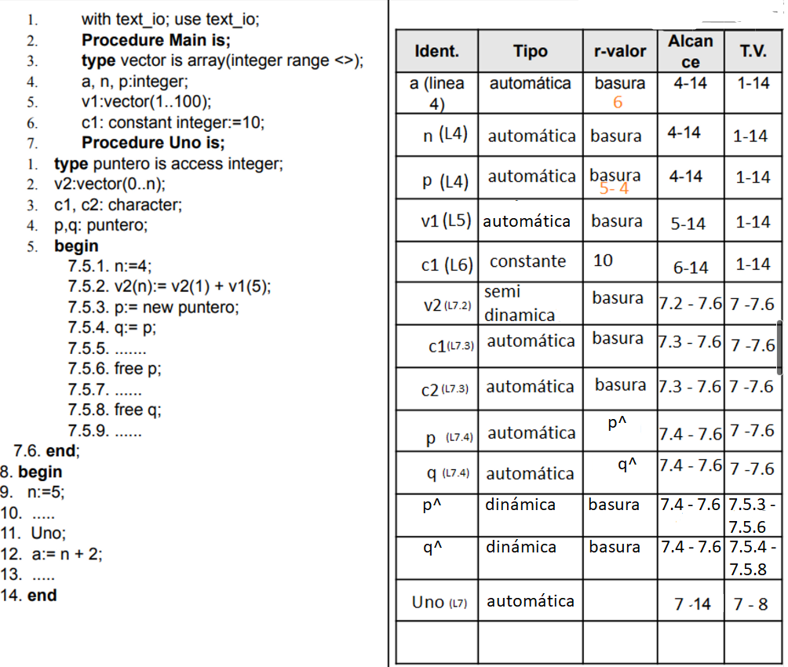
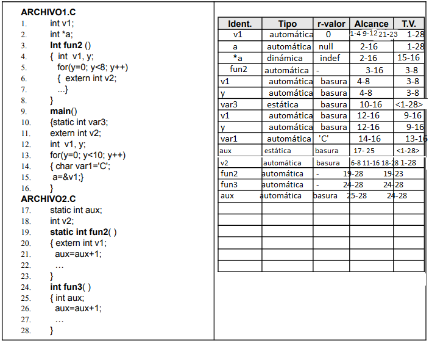

# Práctica 4

# Variables

1.  a.
    | Identificador | Lvalor | Rvalor | Alcance | T. vida |
    | --- | --- | --- | --- | --- |
    | a | automática | 0, 1, 2, 3, 4, 5, 6, 7, 8, 9 | 3-16 | 1-16 |
    | i | automática | 1, 2, 3, 4, 5, 6, 7, 8, 9 | 3-16 | 1-16 |

    b.
    | Identificador | Lvalor | Rvalor | Alcance | T. vida |
    | --- | --- | --- | --- | --- |
    | p | automática | direcciones | 4-16 | 1-16 |
    | p^ | dinámica | puntero a i y luego punto a a | 4-16 | 7-14 |

    

2.  1. Una variable puede inicializarse vacía o con un valor acorde al tipo de la variable. Internamente, si no le asigno un valor en memoria se guardará vacía hasta que la variable tome un valor.
    2. En los lenguajes Java y C, se pueden inicializar variables declarando y asignando un valor en la misma línea o declarando primero la variable y luego asignando un valor. Además, en Java es posible inicializar arreglos mediante la creación de una nueva instancia y especificando su tamaño. En Python y Ruby, las variables se pueden inicializar asignándoles un valor o dejándolas en estado nulo. En general, los cuatro lenguajes permiten la inicialización de variables de manera similar, aunque con algunas diferencias sintácticas. Python y Ruby tienen una sintaxis más simple, mientras que Java y C ofrecen más opciones y control en la inicialización de arreglos.

       | Lenguaje | Sintaxis de inicialización de variables |
       | -------- | --------------------------------------- |
       | Java     | Tipo variable = valor;                  |
       |          | Tipo variable;                          |
       |          | variable = valor;                       |
       |          | Tipo[] variable = new Tipo[tamaño];     |
       | C        | Tipo variable = valor;                  |
       |          | Tipo variable;                          |
       |          | variable = valor;                       |
       |          | Tipo variable[tamaño];                  |
       | Python   | variable = valor                        |
       |          | variable = None                         |
       | Ruby     | variable = valor                        |
       |          | variable = nil                          |

3.  El L-valor se refiere a su dirección en memoria, o sea la ubicación en la que se almacena el valor de la variable. Respecto a los tipos de variables según su atributo L-valor en los lenguajes C y Ada, en C existen variables automáticas, estáticas y dinámicas.

    1. **Variable estática**: mantiene su valor a lo largo del tiempo, incluso cuando sale del alcance de la función o bloque en que se declaró. En este caso, el atributo L-valor de la variable estática es fijo y se asigna en tiempo de compilación. Un ejemplo en C sería:

       ```c
       #include <stdio.h>

       void incremento() {
         static int x = 0;
         x++;
         printf("Valor de x: %d\n", x);
       }

       int main() {
         incremento();
         incremento();
         incremento();
         return 0;
       }
       ```

    2. **Variable automática o semiestática**: se declara dentro de una función o bloque y se destruye cuando se sale de ese ámbito. En este caso, el atributo L-valor de la variable automática es temporal y se asigna en tiempo de ejecución. Un ejemplo en Python sería:

       ```python
       def suma(a, b):
         c = a + b
         return c

       resultado = suma(3, 5)
       print(resultado)
       ```

    3. **Variable dinámica**: es una variable que se asigna y libera en tiempo de ejecución, es decir, su atributo L-valor cambia durante la ejecución del programa. Un ejemplo en C sería:

       ```c
       #include <stdio.h>
       #include <stdlib.h>

       int main() {
         int *p;
         p = (int *) malloc(sizeof(int));
         *p = 10;
         printf("Valor de p: %d\n", *p);
         free(p);
         return 0;
       }
       ```

    4. **Variable semidinámica**: es una variable que se declara estáticamente, pero se asigna y libera dinámicamente durante la ejecución del programa.

       ```c
       #include <stdio.h>
       #include <stdlib.h>

       int main() {
         static int *p;
         p = (int *) malloc(sizeof(int));
         *p = 10;
         printf("Valor de p: %d\n", *p);
         free(p);
         return 0;
       }
       ```

4.  1. Una variable **local** es aquella que tiene alcance dentro del contexto donde fue declarada, por ejemplo si se creo dentro de un método se dice que es local a ese método y sólo podrá ser accedida dentro del mismo. Una variable **global** es una variable que se asigna en el programa principal y su alcance es de todo el programa.
    2. No, una variable local no puede ser estática respecto a su l-valor, ya que el término "estático" se refiere a una propiedad de la variable en sí misma, no al l-valor. Una variable local puede ser declarada como "estática", lo que significa que su valor se mantiene entre llamadas a una función, pero esto no afecta su l-valor.

       Por ejemplo, en el siguiente código, la variable "contador" es declarada como estática dentro de la función "suma". Sin embargo, su l-valor cambia en cada llamada a la función, ya que se asigna a una dirección de memoria diferente en la pila cada vez:

       ```c
       #include <stdio.h>

       int suma(int n) {
           static int contador = 0;
           contador += n;
           return contador;
       }

       int main() {
           printf("%d\n", suma(1)); // imprime 1
           printf("%d\n", suma(2)); // imprime 3
           printf("%d\n", suma(3)); // imprime 6
           return 0;
       }
       ```

    3. No, una variable global no siempre es estática. La propiedad de ser estática o no depende de cómo se declare la variable, no de si es global o local. En C, una variable global se define fuera de cualquier función y está disponible para todas las funciones en el archivo. Si se declara sin la palabra clave "**static**", entonces es una variable global externa y su ámbito se extiende a través de todo el programa, lo que significa que puede ser accedida desde cualquier archivo que incluya su declaración. Por otro lado, si se declara con la palabra clave "static", entonces se convierte en una variable global estática. En este caso, su ámbito sigue siendo global, pero su visibilidad se limita al archivo en el que se define. Esto significa que no se puede acceder a la variable desde otros archivos, pero su valor se mantiene entre llamadas a funciones en el mismo archivo.
    4. La principal diferencia entre una variable estática y una constante es que una variable estática se refiere a una ubicación de memoria que retiene su valor entre llamadas a una función o durante la ejecución del programa, mientras que una constante es un valor que no cambia durante la ejecución del programa. Una variable estática se inicializa solo una vez y se mantiene su valor durante toda la vida útil del programa. Su l-valor puede cambiar, pero su valor se mantiene constante. Por otro lado, una constante es una variable cuyo valor no cambia durante la ejecución del programa, y su l-valor tampoco.

5.  1. En Ada, la clasificación de constantes en numéricas y comunes se debe a la forma en que se definen y utilizan. Las constantes numéricas son aquellas que representan valores numéricos, como enteros, reales, complejos, etc. Estas constantes se definen utilizando una notación numérica estándar y la ligadura se produce durante la compilación; esto significa que los valores de las constantes numéricas se conocen antes de que el programa se ejecute y se incorporan directamente en el código objeto generado por el compilador.

       Por otro lado, las constantes comunes son aquellas que representan valores que no son numéricos, como caracteres, cadenas de texto, tipos enumerados, etc. Estas constantes se definen utilizando una notación específica para cada tipo de constante. No se evalúan durante la compilación. En su lugar, se evalúan en tiempo de ejecución, es decir, cuando el programa se está ejecutando. Esto significa que los valores de las constantes comunes se conocen solo después de que el programa se haya iniciado.

    2. - H: es una constante numérica con el valor _3.5_ del tipo **float**. La ligadura se realiza en la compilación.
       - I: es una constante numérica con el valor **2**, sin tipo especificado así que se asume que es integer. La ligadura se realiza en la compilación.
       - K: se define como una expresión que utiliza las constantes H e I. Dado que tanto H como I son constantes numéricas, su valor se evalúa durante la compilación. Por lo tanto, la constante K también se evalúa durante la compilación, en el primer momento de ligadura.

6.  No tendría el mismo comportamiento en cuanto a alocación de memoria ya que en un principio x está fuera de ambas funciones y es una variable global. Esto significa que x se alojará en la sección de datos estática de la memoria y su valor va a persistir durante la ejecución. Si la movemos a func1() y la asignamos al tipo static entonces será una variable local estática, se alojará en la sección de datos estática pero su ámbito estará limitado a func1().

    En resumen, la versión original del archivo y la versión modificada con la declaración de **`x` c**omo **`static int x = 1;`** tendrán un comportamiento diferente en cuanto a la alocación de memoria. En la versión original, la variable **`x`**será global y persistirá durante toda la ejecución del programa, mientras que en la versión modificada, la variable **`x`**será local estática y solo estará disponible dentro de la función **`func1()`.**

7.  
8.  | Identificador | Tipo           | Alcance  | T. vida  |
    | ------------- | -------------- | -------- | -------- |
    | mipuntero     | automático (f) | 3-15 (b) | 3-15     |
    | mipuntero\*   | dinámico (f)   | 3-15 (b) | 9-12 (a) |
    | i             | automático (f) | 4-15 (b) | 1-15 (a) |
    | h             | automático (f) | 5-15 (b) | 1-15 (a) |

    c. No presenta error ya que **mipuntero^** indica el valor entero de la dirección de dicho puntero.

    d. Si presenta error, ya que estoy tratando de asignarle a una variable entera `i` la resta de un entero `h` y una dirección `mipuntero`.

    e. Existe el tipo `tpuntero`, pero no se si considerarlo una entidad o no. Por las dudas lo declaro.

9.  Está hecho en la explicación práctica:

    ```c
    1. static int aux;
    2. int v2;
    3. static int fun2( )
    4. { extern int v1;
    5. aux=aux+1;
    6. }
    7. int fun3( )
    8. { int aux;
    9. aux=aux+1;
    10. }
    ```

    | Identificador | Lvalor     | Rvalor | Alcance  | T. vida | Inciso |
    | ------------- | ---------- | ------ | -------- | ------- | ------ |
    | aux           | estática   | 0-1    | 1-8 10-> | 1-10    | B      |
    | v2            | automática | 0      | 2-10     | 1-10    | A      |
    | fun2          |            |        | 3-10     | 3-6     | B      |
    | v1            | automática |        | 4-6      | 3-6     | A      |
    | fun3          |            |        | 7-10     | 7-10    | C      |
    | aux           | automática |        | 8-10     | 7-10    | A      |

10. En general, `c` tendrá un alcance y tiempo de vida limitado al procedimiento en el que se encuentra definida, siempre y cuando no haya definiciones de procedimientos internos. Esto significa que `c` será accesible sólo dentro del procedimiento y su valor será válido mientras el procedimiento esté en ejecución.
11. 1. El tipo de dato de una variable es…
       1. Falso. Este enunciado se refiere a los identificadores, no al tipo de variable.
       2. Falso. Este enunciado describe el rango de valores que una variable puede tomar y el ámbito en el que se puede utilizar, pero no define el tipo de datos de la variable.
       3. Verdadero. El tipo de datos de una variable se refiere al conjunto de valores que puede tomar y el lugar de memoria asociado con la variable.
       4. Verdadero. El tipo de datos de una variable se refiere al conjunto de valores que puede tomar y el conjunto de operaciones que se pueden realizar sobre esos valores.
    2. La definición correcta del tipo de datos de una variable es el conjunto de valores que puede tomar la variable y el conjunto de operaciones que se pueden realizar sobre esos valores. Además, el tipo de datos también define la forma en que se almacena la variable en la memoria del ordenador y la cantidad de memoria necesaria para almacenarla. El tipo de datos es esencial para garantizar la seguridad y la integridad de los datos en un programa, ya que determina cómo se pueden manipular los datos almacenados en las variables.
12. 
13. El nombre de una variable puede condicionar su alcance, su tiempo de vida y su tipo, pero no su r-valor.
    1. El **nombre** de la variable puede afectar su **_tiempo de vida_** si se define dentro de un bloque o función en particular.
    2. El **nombre** de la variable puede afectar su **_alcance_** si se define dentro de un bloque, función o módulo en particular.
    3. El **_r-valor_** de una variable se refiere al valor que se le asigna a la variable o al valor que se obtiene de la variable en una expresión. El **nombre** de la variable no afecta su r-valor.
    4. El **nombre** de la variable puede afectar su **_tipo_** si se utiliza un nombre que sugiere un tipo de datos específico. Por ejemplo, si se utiliza el nombre "edad" para una variable, se asume que su tipo de datos es entero o número, y no una cadena o un valor booleano.
14. 
15. En JavaScript, existen cuatro formas de declarar variables: **`const`**, **`var`**, **`let`** y la ausencia de cualquiera de estos.

    - **`const`** se utiliza para declarar una variable que no cambiará de valor en todo el programa. Una vez que se asigna un valor a una variable constante, no se puede cambiar.
    - **`var`** se utilizaba antes de la introducción de **`let`** en ECMAScript 6, y aún es compatible con versiones antiguas de JavaScript. **`var`** tiene un alcance de función o global, lo que significa que una variable declarada con **`var`** dentro de una función estará disponible en cualquier lugar dentro de esa función. También se puede utilizar para declarar variables globales.
    - **`let`** se utiliza para declarar una variable cuyo valor puede cambiar. A diferencia de **`var`**, tiene un alcance de bloque, lo que significa que una variable declarada con **`let`** dentro de un bloque (por ejemplo, dentro de un **`if`** o un **`for`**) no estará disponible fuera de ese bloque.

    Si declaramos una variable sin utilizar ninguna palabra clave, como **`var`**, **`let`** o **`const`**, se convierte en una variable global si se declara fuera de una función. Esto significa que estará disponible en cualquier lugar del programa y su valor se puede cambiar en cualquier momento.

    Comparando con un lenguaje como Python, la diferencia semántica es similar en cuanto a la asignación de variables. Python tiene una palabra clave **`const`** llamada **`final`**, que se utiliza para declarar variables constantes en Python 3.8 y versiones posteriores. En Python, la declaración de variables se realiza automáticamente al asignar un valor a una variable, no es necesario utilizar ninguna palabra clave para declarar una variable.

    En general, la principal diferencia semántica entre **`const`**, **`var`**y **`let`** en JavaScript es el alcance y la capacidad de cambiar el valor de la variable. Mientras que en Python, la declaración de variables es más simple, ya que no es necesario utilizar ninguna palabra clave para declarar una variable.
