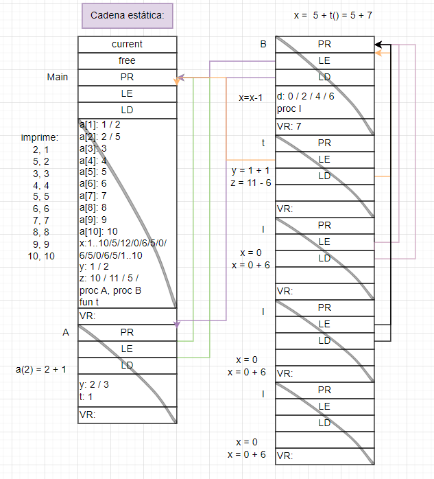
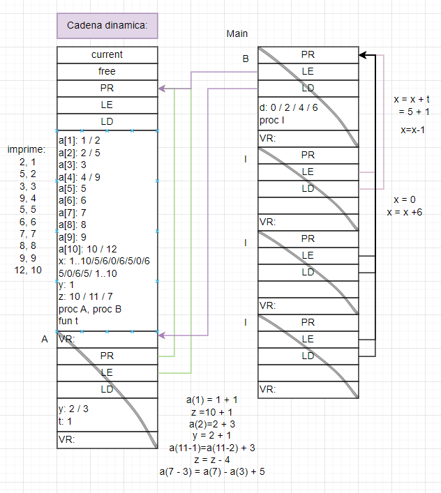
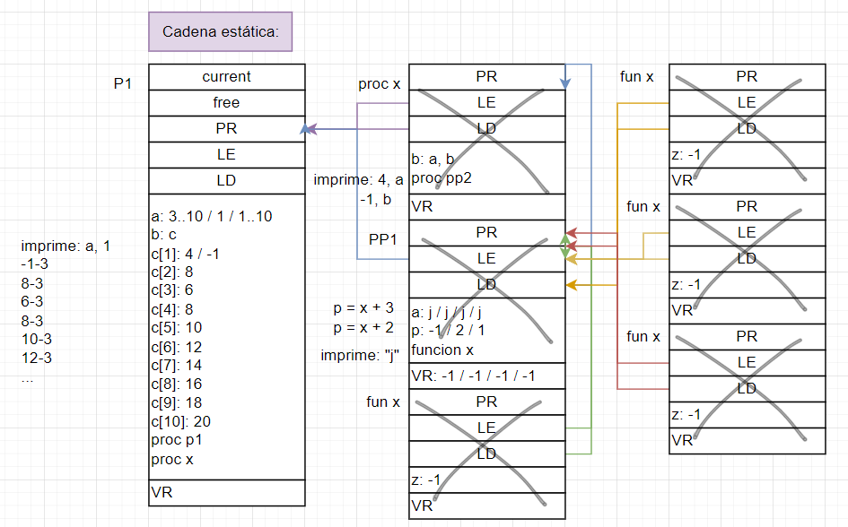
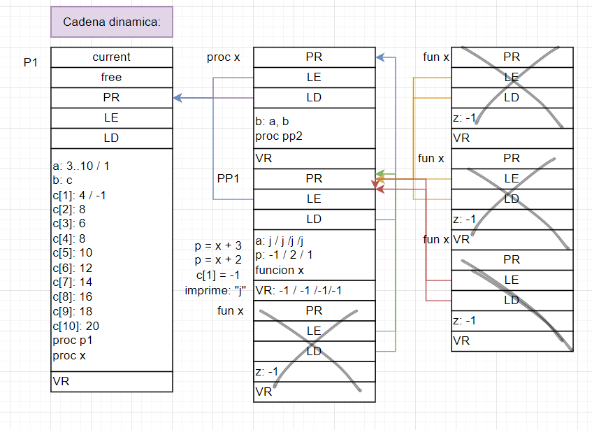
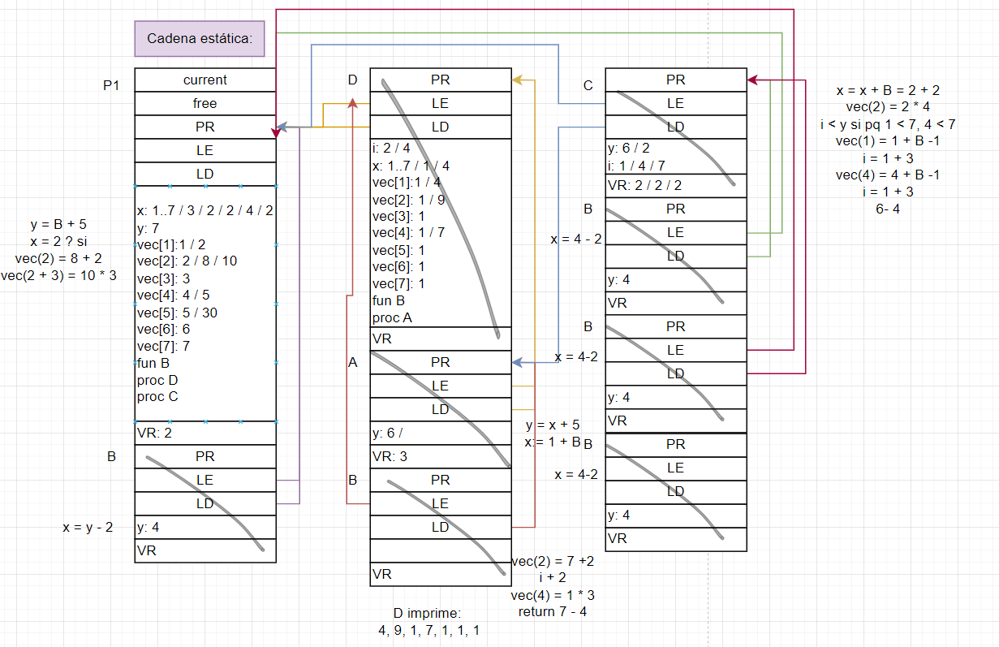
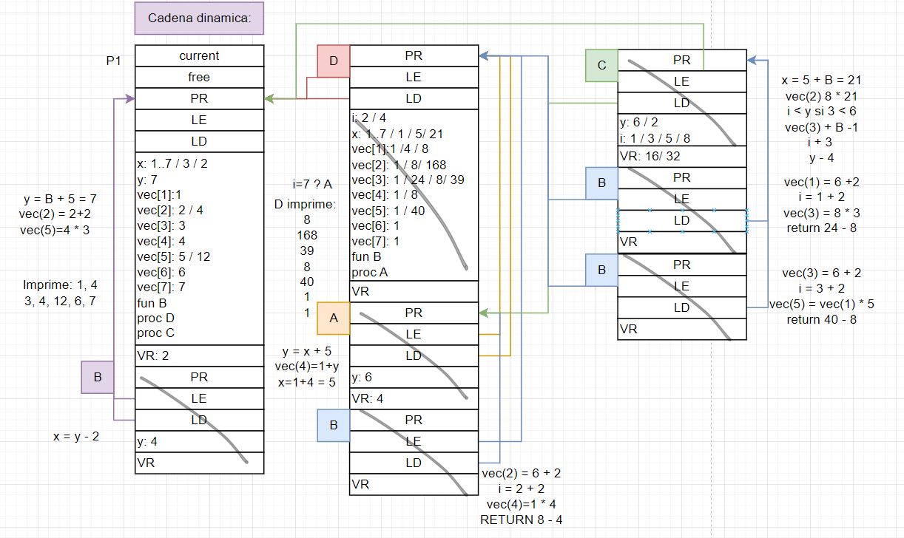
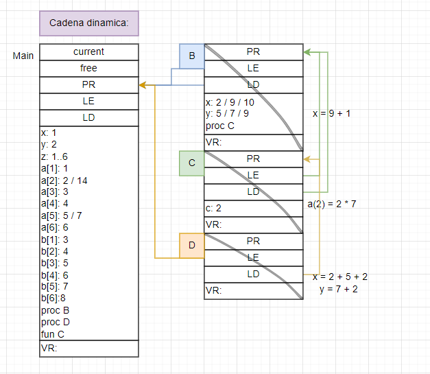

# Práctica 5

# Pila

1. El registro de activación es una estructura de datos crítica en la ejecución de programas que permite el correcto almacenamiento y recuperación de los valores de registros necesarios para la ejecución de funciones y procesos. Consta de varias partes, entre ellas:

   | Partes           | Representación                                                                                                                                       |
   | ---------------- | ---------------------------------------------------------------------------------------------------------------------------------------------------- |
   | Punto de retorno | El punto de retorno es la dirección de memoria donde un programa debe continuar su ejecución luego de que una rutina llama a la otra y esta termina. |
   | EE               | El enlace estático es el puntero a la dirección base de la rutina que lo contiene estáticamente, quien lo define.                                    |
   | ED               | El enlace dinámico es el puntero a la dirección base de la rutina llamadora.                                                                         |
   | Variables        | Variables de la unidad que se van reemplazando a medida que avanza el programa.                                                                      |
   | Parámetros       | Valores de los parámetros de la rutina.                                                                                                              |
   | Procedimientos   | Identificadores de los procedimientos.                                                                                                               |
   | Funciones        | Identificadores de las funciones.                                                                                                                    |
   | Valor de retorno | Valores retornados por funciones que se llaman desde la rutina.                                                                                      |

2. Ejercicio 2

   1. 

   2. 

3. //CONSULTAR SI LOS WRITE HAY QUE ESCRIBIRLOS — si, al costadito hay que poner lo que imprime

   1. 

   2. 

4. Este punto probablemente este mal, mas que nada la parte de estática porque no me di cuenta que dentro de D hay una función B :(

   1. 

   2. 

5. Ejercicio 5

   1. 

   2. 

   3. No es lo mismo debido a que según el orden puede variar sobre quién busca los datos.
